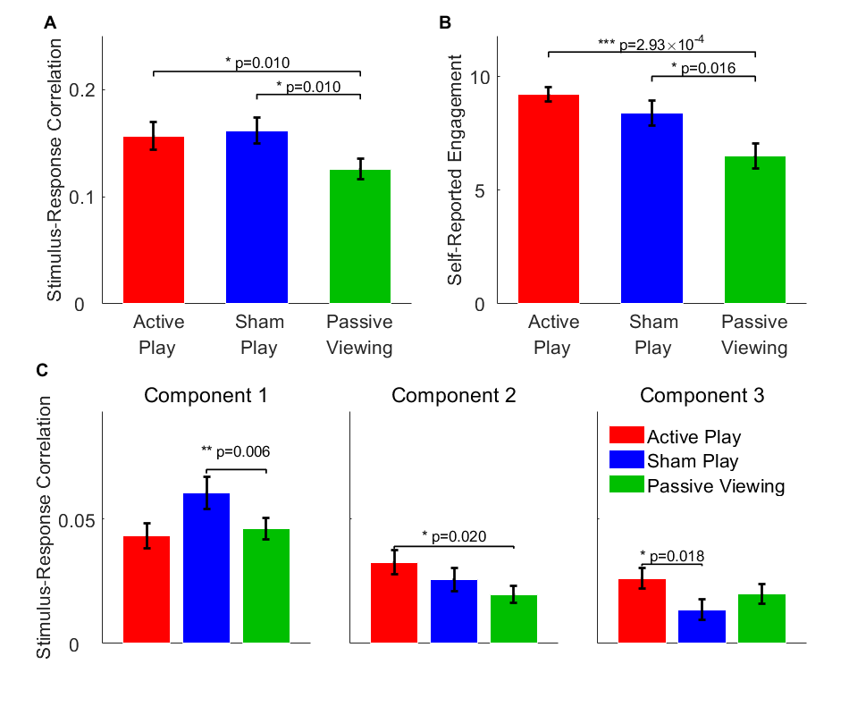

# Active-Passive-SRC-Publication Source Code
#### In submission.

###### Title: Action enhances perception:  Visually evoked neuralresponses are enhanced when engaging in a motor task
###### Authors: Jason J. Ki, Lucas C. Parra, Jacek P. Dmochowski
###### Institution: Department of Biomedical Engineering, City College of New York, NewYork, NY 10031, USA

## Summary
<p align="center">
    
    <figcaption> We measured correlation of visual stimulus activity with neural response with/without motor en-gagement during presentation of race kart video game.</figcaption>
</p>

<p align="center">
    
    <figcaption> And found that visul responses are more reliable during active motor engagment. </figcaption>
</p>

## Getting Started
#### Installing depedencies

MATLAB
```
>> cd Active-Passive-SRC-Publication
>> setup install save
````

#### Generate the paper figures
```
>> cd scripts
>> generate_all_figures.m
```
