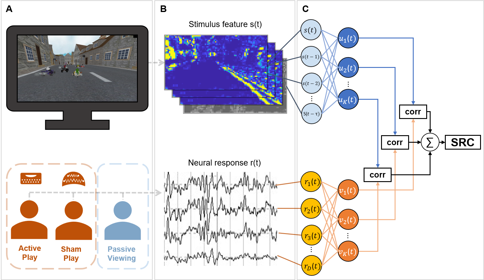

# Active-Passive-SRC-Publication Source Code

<p>
    
</p>

Title: Action enhances perception:  Visually evoked neuralresponses are enhanced when engaging in a motor task
Authors: Jason J. Ki, Lucas C. Parra, Jacek P. Dmochowski
Institution: Department of Biomedical Engineering, City College of New York, NewYork, NY 10031, USA

Abstract:
While it is well known that vision guides movement, it is less appreciated that motor cortex also provides input to the visual system. Here we asked whether neural processing of visual stimuli is acutely modulated during motor activity, hypothesizing that visual evoked responses are enhanced when subjects engage in a motor task.  To test this, we recorded neural activity from  human participants during a car racing video game under 3 conditions: active play with manual control, passive viewing of game playback, and ``sham play'', where participants were under the false impression that their brain activity was controlling the game. This condition aimed to engage the motor system while avoiding evoked responses related to actual movement or somatosensation.  In each case, we assessed the strength of evoked responses as the temporal correlation between the visual stimulus and the evoked electroencephalogram (EEG). We found reduced correlation during passive viewing, but no difference between active and sham play. Moreover, participants that were successfully deceived showed more correlated responses in the sham condition compared to those that were not deceived. Alpha band (8-12 Hz) activity was reduced over motor cortex during sham play, indicating recruitment of motor cortex despite the absence of overt movement.  These findings are the first to demonstrate a link between visual evoked responses and motor cortex engagement.    

#### Under submission.

### Getting Started
#### Installing depedencies

MATLAB
```
>> cd Active-Passive-SRC-Publication
>> setup install save
````

#### Generate the paper figures
```
>> cd scripts
>> generate_all_figures.m
```
